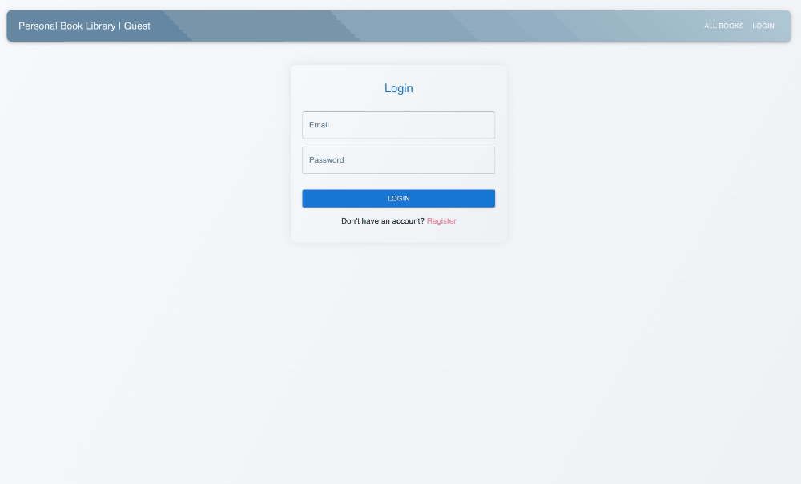

# Personal Book Library Frontend



A sleek and user-friendly frontend for the Personal Book Library API. Built with React, this application allows users to manage their personal book collection, view book details, search for books, and much more!

## Table of Contents

- [Personal Book Library Frontend](#personal-book-library-frontend)
  - [Table of Contents](#table-of-contents)
  - [Features](#features)
  - [Getting Started](#getting-started)
    - [Prerequisites](#prerequisites)
    - [Installation](#installation)
  - [Usage](#usage)
  - [API Endpoints](#api-endpoints)
  - [Acknowledgments](#acknowledgments)

## Features

- **User Authentication:** Secure login and registration system.
- **Book Management:** Add, update, and remove books from your collection.
- **Search Functionality:** Search for books based on title, author, or genre.
- **Book Details:** View detailed information about each book, including its writer and readers.
- **Responsive Design:** Looks great on both desktop and mobile devices.

## Getting Started

These instructions will get you a copy of the project up and running on your local machine for development and testing purposes.

### Prerequisites

- Node.js
- npm

### Installation

1. Clone the repository:
   ```bash
   git clone https://github.com/your_username/PersonalBookLibraryFrontend.git
   ```

2. Navigate to the project directory:
   ```bash
   cd PersonalBookLibraryFrontend
   ```

3. Install the required packages:
   ```bash
   npm install
   ```

4. Start the development server:
   ```bash
   npm start
   ```

The application should now be running on `http://localhost:3000/`.

## Usage

1. **Homepage:** Navigate through a list of books and use the search bar to find specific books.
2. **Book Details Page:** Click on a book to view its detailed information and manage it.
3. **Add Book/Page/Writer:** Use the respective forms to add new entries to the library.
4. **User Profile:** View and manage your personal details and book collection.

## API Endpoints

The frontend interacts with the following API endpoints:

1. **Name:** Create Writer
   - **Method:** POST
   - **URL:** http://localhost:8080/api/writers

2. **Name:** Create Book
   - **Method:** POST
   - **URL:** http://localhost:8080/api/books

3. **Name:** GET Books
   - **Method:** GET
   - **URL:** http://localhost:8080/api/books

4. **Name:** GET Books Search
   - **Method:** GET
   - **URL:** http://localhost:8080/api/books/search?title=Enchanted&keyword=tale

5. **Name:** GET Book
   - **Method:** GET
   - **URL:** http://localhost:8080/api/books/9

6. **Name:** GET Book Writer
   - **Method:** GET
   - **URL:** http://localhost:8080/api/books/9/writer

7. **Name:** GET Book Current Readers
   - **Method:** GET
   - **URL:** http://localhost:8080/api/books/17/currentreaders

8. **Name:** GET Book Readers
   - **Method:** GET
   - **URL:** http://localhost:8080/api/books/17/readers

9. **Name:** Add Book
   - **Method:** PATCH
   - **URL:** http://localhost:8080/api/books/8/add

10. **Name:** Remove Book
    - **Method:** DELETE
    - **URL:** http://localhost:8080/api/books/8/remove

11. **Name:** Read Book
    - **Method:** PATCH
    - **URL:** http://localhost:8080/api/books/17/read

12. **Name:** Next Book Page
    - **Method:** PATCH
    - **URL:** http://localhost:8080/api/books/nextpage

13. **Name:** Prev Book Page
    - **Method:** PATCH
    - **URL:** http://localhost:8080/api/books/previouspage

14. **Name:** Create Reader
    - **Method:** POST
    - **URL:** http://localhost:8080/api/readers

## Acknowledgments

- Thanks to all contributors and testers for making this project possible.
- Special thanks to the React community for their invaluable resources and support.
